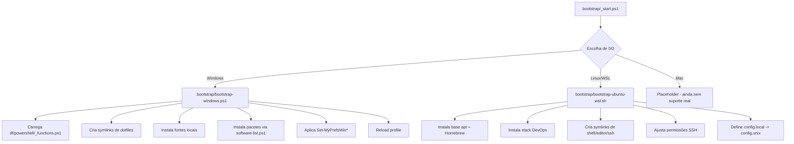
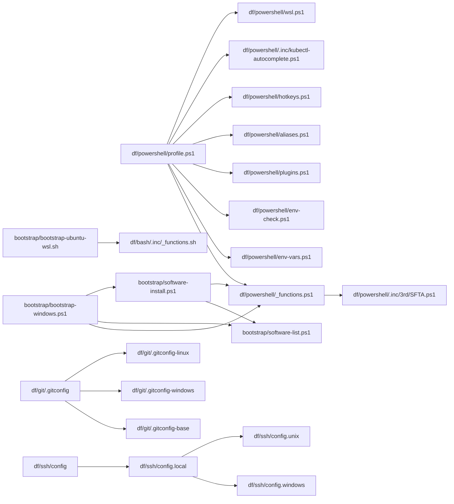

# Dotfiles Context Map

## Objetivo do repositório
Repositório de dotfiles pessoais para provisionamento e padronização de ambiente em:
- Windows (host principal)
- Ubuntu via WSL
- Linux/macOS (parcial)

O foco é replicar shell, ferramentas, editor, terminal, Git/SSH e preferências de sistema de forma automatizada.

## Estrutura principal
- `bootstrap/`: entrada de provisionamento e instalação de softwares.
- `df/powershell/`: perfil, funções utilitárias e automações de Windows.
- `df/bash/` e `df/zsh/`: configuração de shell Unix.
- `df/git/`: configuração base e overlays por ambiente (`includeIf`).
- `df/ssh/`: configuração SSH multiplaforma + chaves.
- `df/vscode/`: settings, keybindings e snippets.
- `df/windows-terminal/`: perfis e atalhos do Windows Terminal.
- `df/oh-my-posh/`: tema de prompt.
- `df/assets/`: fontes e ícones usados por associações visuais e terminal.

## Fluxo de bootstrap

### Diagrama de fluxo de bootstrap por SO

### Windows
1. `bootstrap/_start.ps1`
- valida pré-requisitos (winget, OneDrive, drive `D:`, clone de dotfiles)
- oferece menu interativo (Windows novo/refresh, Linux, Mac)
- para Windows: importa funções e chama `bootstrap/bootstrap-windows.ps1`

2. `bootstrap/bootstrap-windows.ps1`
- valida execução elevada
- cria symlinks de diretórios e arquivos de configuração
- aplica SSH config local via symlink (`config.local -> config.windows`)
- vincula perfil PowerShell, VS Code, Windows Terminal
- instala fontes locais (`Install-FontWindows`)
- instala pacotes e módulos a partir de `software-list.ps1`
- aplica preferências de Windows (data/hora, teclado, regionalização, Explorer)

3. `bootstrap/software-list.ps1` + `bootstrap/software-install.ps1`
- catálogo central de pacotes (`winget`, `choco`, `powershell-module`, `pip`)
- execução por instalador usando funções de `df/powershell/_functions.ps1`

### Linux/WSL
1. `bootstrap/bootstrap-ubuntu-wsl.sh`
- instala base (`apt`) e ecossistema de tooling (`brew`)
- instala toolchain DevOps (kubectl, helm, flux, terraform, etc.)
- cria symlinks para shells/config e pastas de trabalho
- ajusta permissões SSH e configura `config.local -> config.unix`

2. `df/bash/.inc/_functions.sh`
- helper de instalação `installPKG` (brew/apt) e output de status

## Mapa de dependências entre scripts

Dependências críticas:
- `profile.ps1` depende de variáveis e funções de `_functions.ps1` para plugins/aliases.
- `bootstrap-windows.ps1` depende fortemente de `_functions.ps1` para instalação, symlink e prefs.
- `software-install.ps1` e `software-list.ps1` formam o pipeline de provisioning de apps.
- `df/ssh/config` exige `config.local` válido para resolver ambiente.
- `df/git/.gitconfig` exige arquivos include (`.gitconfig-base` e overlays) existentes no host.

## Carga de perfil e runtime

### PowerShell
Arquivo principal: `df/powershell/profile.ps1`

Ordem de carga relevante:
1. `_functions.ps1`
2. `env-vars.ps1`
3. `env-check.ps1`
4. `plugins.ps1`
5. `aliases.ps1`
6. `hotkeys.ps1`
7. `kubectl-autocomplete.ps1`
8. `wsl.ps1`
9. `extras.ps1` (opcional)

Recursos carregados:
- oh-my-posh
- módulos (`posh-git`, `posh-docker`, `Terminal-Icons`, `PSReadLine`, `gsudoModule`)
- integração WSL (`Import-WslCommand`)
- `winfetch` no startup do Windows

### Bash/Zsh
- `df/bash/.bashrc`: aliases, brew shellenv, oh-my-posh, kubectl completion, atuin, fastfetch.
- `df/.aliases`: aliases globais e atalhos GitOps/Kubernetes.
- `df/zsh/.zprofile`/`.zshenv`/`.zshrc`: inicialização oh-my-zsh e aliases compartilhados.

## Núcleo funcional (PowerShell)
Arquivo: `df/powershell/_functions.ps1` (funções de infraestrutura)

Grupos principais:
- sistema de links e checks: `Add-Symlink`, `Test-CommandExists`, `Test-PowershellElevated`
- instalação: `Install-WinGetApp`, `Install-ChocoApp`, `Install-PowershellModule`, `Install-PipPackage`
- preferências de Windows: `Set-MyPrefsWin*`
- associação de arquivos: `Set-MyPrefsWinFileAssociations` (usa `df/powershell/.inc/3rd/SFTA.ps1`)
- utilitários: `Show-TrayIcon`, `Copy-KubeConfig`, `Install-FontWindows`, `Start-CountDown`

## Git e SSH por ambiente

### Git
Arquivo de entrada: `df/git/.gitconfig`
- aliases avançados de Git
- `includeIf` por caminho (`C:/`, `D:/`, `/mnt/c/`, `/home/`, `/Users/`, `/workspaces/`)
- overlays esperados:
  - `~/.gitconfig-windows`
  - `~/.gitconfig-linux`
  - `~/.gitconfig-wsl-windowsfs`
  - `~/.gitconfig-devcontainer*`
  - `~/.gitconfig-base`

### SSH
Arquivo de entrada: `df/ssh/config`
- defaults globais seguros
- hosts específicos
- delega variação de ambiente para `Include ~/.ssh/config.local`

Variantes:
- `df/ssh/config.windows`: compatível OpenSSH no Windows
- `df/ssh/config.unix`: usa `Match exec "test -S /tmp/1password-agent.sock"` para 1Password agent condicional

## Editor e terminal
- VS Code: `df/vscode/settings.json`, `keybindings.json`, `snippets/vue.json`
- Windows Terminal: `df/windows-terminal/settings.json`
- Prompt: `df/oh-my-posh/pablo.omp.json`
- Winfetch: `df/winfetch/config.ps1`

## Particularidades do projeto
- Forte acoplamento com OneDrive (`D:\\OneDrive` / `/mnt/d/OneDrive`) e estrutura pessoal de pastas.
- Alto volume de assets versionados (ícones/fontes) para personalização visual.
- Scripts de suporte em `readme/` e `bootstrap/scripts/` (nem todos fazem parte do fluxo ativo).

## Pontos de atenção (prioridade)
1. Segredos e credenciais versionados em arquivos de config (tokens/chaves).
2. Chaves privadas SSH e chave age no repositório.
3. Inconsistências funcionais:
- `Install-PipPackage` com condição invertida.
- `Install-CustomApp`/`Install-CustomPackage` referenciam nomes de função divergentes.
- `profile.ps1` carrega `_functions.ps1` duas vezes.
- validação de caminho no symlink de VS Code em `bootstrap-windows.ps1` parece invertida.

## Backlog priorizado de correções (segurança + bugs funcionais)

### P0 (imediato)
1. Remover segredos versionados (tokens/chaves) e rotacionar credenciais comprometidas.
2. Tirar chaves privadas (`df/ssh/*`, `df/secrets/dotfiles.age.local.key`) do Git e mover para cofre seguro.
3. Sanitizar `README.md`, `df/powershell/env-vars.ps1`, `df/bash/.bashrc`, `df/vscode/settings.json`.

### P1 (alta)
1. Corrigir condição invertida de `Install-PipPackage` em `df/powershell/_functions.ps1`.
2. Corrigir chamadas inválidas:
   - `Install-CustomApp`/`Install-CustomPackage` usam `Download-CustomApp` e `Extract-Download` não definidos.
   - alinhar para `Get-Download` e `Expand-Download` ou renomear consistentemente.
3. Remover carga duplicada de `_functions.ps1` em `df/powershell/profile.ps1`.
4. Ajustar check de remoção/symlink de VS Code em `bootstrap/bootstrap-windows.ps1`.

### P2 (média)
1. Consolidar aliases duplicados em `df/.aliases`.
2. Revisar scripts legados em `bootstrap/scripts/` e marcar claramente `deprecated` vs `active`.
3. Padronizar nomes/idioma de comentários e mensagens em scripts.
4. Separar configuração sensível de configuração pública usando `.sample` + arquivo local ignorado.

### P3 (evolução)
1. Adicionar validação pré-bootstrap (dry-run) para detectar caminhos ausentes antes de alterar sistema.
2. Adicionar testes automatizados mínimos para funções críticas de `_functions.ps1`.
3. Criar matriz de suporte por ambiente (Windows host, WSL, Linux nativo, devcontainer).

## Estado atual de entendimento
Cobertura da análise:
- todos os arquivos versionados textuais e de configuração relevantes
- inventário de binários/assets
- leitura estrutural de arquivos sensíveis sem exibir conteúdo secreto

Este arquivo deve servir como base para:
- refactors seguros
- correção incremental de bootstrap
- hardening de segurança (remoção de segredos do Git)
