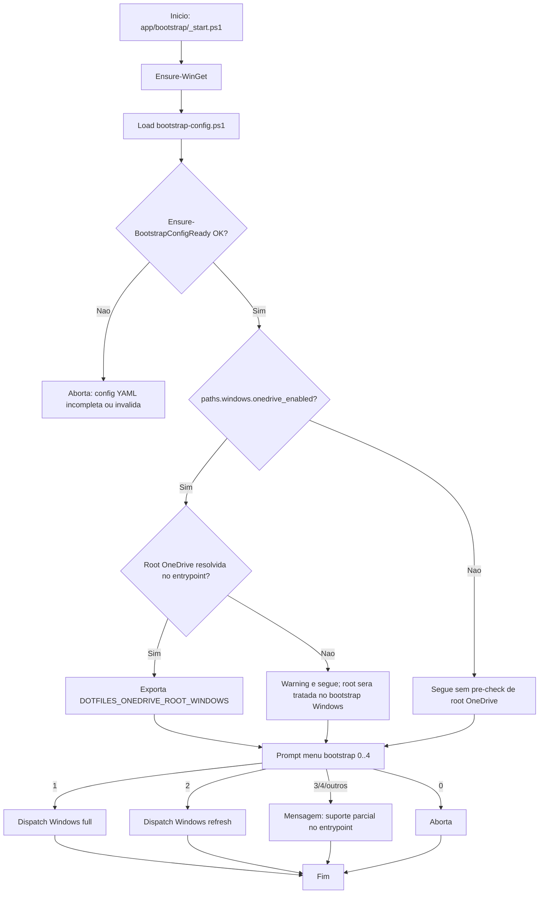
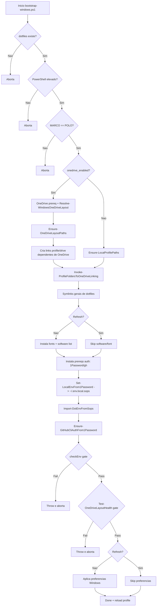
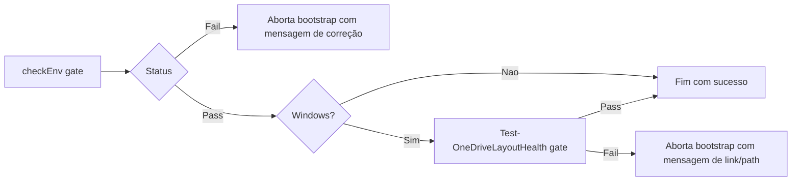

# Fluxograma Completo do Bootstrap (Windows + WSL + OneDrive)

Documentacao visual e textual do fluxo atual de bootstrap, cobrindo etapas, decisoes, gates e pontos de falha.

## 1) Objetivo e escopo

Este documento cobre o processo end-to-end de:

- [`app/bootstrap/_start.ps1`](../app/bootstrap/_start.ps1) (entrypoint no Windows);
- [`app/bootstrap/bootstrap-windows.ps1`](../app/bootstrap/bootstrap-windows.ps1) (modos full e refresh);
- [`app/bootstrap/bootstrap-ubuntu-wsl.sh`](../app/bootstrap/bootstrap-ubuntu-wsl.sh) (fluxo WSL);
- pre-requisito OneDrive (instalacao, setup inicial e migracao de root);
- gates obrigatorios de conformidade (`checkEnv` e `Test-OneDriveLayoutHealth`).

Limites atuais:

- o menu mostra opcoes Linux/Mac no `_start.ps1`, mas o dispatch operacional real atual e focado em Windows;
- no WSL o fluxo e executado pelo script dedicado [`app/bootstrap/bootstrap-ubuntu-wsl.sh`](../app/bootstrap/bootstrap-ubuntu-wsl.sh).

## 2) Legenda e convencoes

- **Retangulo**: etapa de execucao.
- **Losango**: decisao/ramificacao.
- **Nó de erro/abort**: etapa que interrompe o fluxo.
- **Gate obrigatorio**: validacao que precisa passar para seguir.

Convencoes de label:

- `checkEnv gate`: validacao de conformidade de ambiente.
- `OneDrive prereq`: etapa de pre-requisito OneDrive antes das linkagens dependentes.
- `Refresh vs Full`: desvio de comportamento por modo.

## 3) Fluxo macro ([`app/bootstrap/_start.ps1`](../app/bootstrap/_start.ps1))



Nota importante do modo `1` (Windows full):

- apos o retorno de [`app/bootstrap/bootstrap-windows.ps1`](../app/bootstrap/bootstrap-windows.ps1), o `_start.ps1` ainda executa ajustes adicionais (`Set-ComputerName`, regionalizacao/explorer) e reinicia o Explorer.

## 4) Subfluxo Windows ([`app/bootstrap/bootstrap-windows.ps1`](../app/bootstrap/bootstrap-windows.ps1))



Resumo operacional do subfluxo:

- todas as linkagens que dependem do OneDrive ficam **depois** da etapa de pre-requisito OneDrive;
- mesmo em refresh, auth/secrets/checks continuam obrigatorios;
- `checkEnv` e `Test-OneDriveLayoutHealth` funcionam como gates de parada.

## 5) Subfluxo OneDrive (Windows)

```mermaid
flowchart TD
    A[Entrada: onedrive_enabled=true] --> B[Resolve requested root (YAML/env/default)]
    B --> C{Configured root encontrada no registro?}

    C -- Nao --> D{OneDrive instalado?}
    D -- Nao --> D1[Instala OneDrive via winget]
    D1 --> D2[Prompt root desejada absoluta]
    D2 --> D3[Pre-seed junction default->desired quando aplicavel]
    D3 --> D4[Start OneDrive e aguarda setup/login do usuario]
    D4 --> D5{Configured root encontrada apos setup?}
    D5 -- Nao --> D6[Throw e aborta]
    D5 -- Sim --> E[Usa root configurada]

    D -- Sim --> F[Warn: instalado sem root configurada]
    F --> D4

    C -- Sim --> G[Mostra root atual]
    G --> H{Mover/alterar root?}
    H -- Nao --> E
    H -- Sim --> I[Prompt nova root absoluta]
    I --> J{Root diferente da atual?}
    J -- Nao --> E
    J -- Sim --> K{onedrive_auto_migrate=true?}
    K -- Nao --> E
    K -- Sim --> L[Stop client -> robocopy -> junction]
    L --> M[Atualiza UserFolder no registro (best-effort)]
    M --> N[Start client]
    N --> O[Usa root desejada]

    E --> P[Resolve paths: root/clients/projects]
    O --> P
    P --> Q[Retorna layout para linkagens dependentes]
```

Regras importantes:

- quando root nao existe/configurada, o bootstrap exige conclusao de setup antes de seguir;
- migracao automatica e best-effort, com fallback de junction para reduzir risco de quebra;
- sem `onedrive_enabled`, o bootstrap usa layout local e nao tenta etapa OneDrive.

## 6) Subfluxo WSL ([`app/bootstrap/bootstrap-ubuntu-wsl.sh`](../app/bootstrap/bootstrap-ubuntu-wsl.sh))

```mermaid
flowchart TD
    A[Inicio bootstrap-ubuntu-wsl.sh] --> B{Prompt MARCO=POLO?}
    B -- Nao --> B1[Aborta]
    B -- Sim --> C[setup_fonts]
    C --> D[install_software (apt + brew)]
    D --> E{DOTFILES_ADD_USER habilitado?}
    E -- Sim --> F[add_user]
    E -- Nao --> G[skip add_user]
    F --> H[setProfileSymlinks]
    G --> H
    H --> I[ensureOpToken]
    I --> J[setLocalEnvFile -> ~/.env.local.sops]
    J --> K[importLocalEnvFromSops]
    K --> L[persistSopsAgeEnv]
    L --> M[ensureOpSshSignAlias]
    M --> N[ensureGitHubAuth]
    N --> O[ln ~/.ssh/config.local]
    O --> P{checkEnv gate}
    P -- Fail --> P1[Aborta]
    P -- Pass --> Q[Fim]
```

## 7) Gates de conformidade



## 8) Tabela de rastreabilidade (diagrama -> codigo)

| Bloco do fluxo | Arquivo | Funcoes/pontos-chave |
|---|---|---|
| Entry macro | [`app/bootstrap/_start.ps1`](../app/bootstrap/_start.ps1) | `Ensure-WinGet`, `Ensure-BootstrapConfigReady`, `bootstrap` (menu/dispatch) |
| Config YAML | [`app/bootstrap/bootstrap-config.ps1`](../app/bootstrap/bootstrap-config.ps1) | `Ensure-BootstrapConfigReady`, `Invoke-BootstrapConfigWizard`, `Sync-BootstrapDerivedFiles` |
| OneDrive prereq/migracao | [`app/bootstrap/bootstrap-windows.ps1`](../app/bootstrap/bootstrap-windows.ps1) | `Resolve-WindowsOneDriveLayout`, `Install-OneDriveClient`, `Invoke-OneDriveJunctionMigration`, `Set-OneDriveConfiguredRoot` |
| Linkagens Windows | [`app/bootstrap/bootstrap-windows.ps1`](../app/bootstrap/bootstrap-windows.ps1) | `Resolve-WindowsLinkLayout`, `Ensure-OneDriveLayoutPaths`, `Invoke-ProfileFoldersToOneDriveLinking`, `Add-Symlink` |
| Secrets/auth Windows | [`app/bootstrap/bootstrap-windows.ps1`](../app/bootstrap/bootstrap-windows.ps1) | `Set-LocalEnvFrom1Password`, `Import-DotEnvFromSops`, `Ensure-GitHubCliAuthFrom1Password` |
| Gate Windows | [`app/bootstrap/bootstrap-windows.ps1`](../app/bootstrap/bootstrap-windows.ps1) + [`app/df/powershell/_functions.ps1`](../app/df/powershell/_functions.ps1) | `checkEnv`, `Test-OneDriveLayoutHealth` |
| Fluxo WSL | [`app/bootstrap/bootstrap-ubuntu-wsl.sh`](../app/bootstrap/bootstrap-ubuntu-wsl.sh) | `setup_prompt`, `install_software`, `setProfileSymlinks`, `ensureOpToken`, `setLocalEnvFile`, `ensureGitHubAuth`, `checkEnv` |

---

Referencias relacionadas:

- [`app/bootstrap/README.md`](../app/bootstrap/README.md)
- [`docs/onedrive.md`](onedrive.md)
- [`docs/checkenv.md`](checkenv.md)
